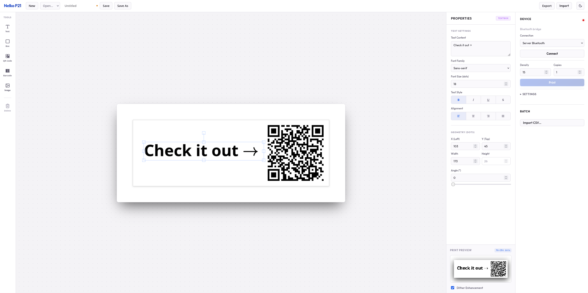

# Nelko P21 Label Printer: Web App & CLI

[](https://react.dev)
[](https://www.typescriptlang.org/)
[](https://www.python.org/)
[](https://www.docker.com/)

This repository provides an all-in-one suite for designing and printing labels with the **Nelko P21 Label Printer** without relying on the official proprietary app.



> [!NOTE]
> **Origin & Attribution:** This project is an extended fork of the original CLI utility and reverse-engineering work by Merlin Schumacher at [merlinschumacher/nelko-p21-print](https://github.com/merlinschumacher/nelko-p21-print). This fork wraps the original protocol capabilities into a modern, full-featured web application, local print server, and containerized deployment system.

> [!WARNING]
> **Android/Mobile build is untested:** The Android integration has not been verified. At this time, the only fully working end-to-end printing solution is using the Python Bluetooth/WebSocket bridge or a Docker deployment on a host PC with a Bluetooth Classic connection to the printer.

---

## Key Features

- **Interactive Web Editor:** A rich, responsive WYSIWYG canvas-based label designer built with React, TypeScript, and Vite.
- **Multiple Transport Methods:**
  - **Web Serial:** Print directly from supported browsers (Chrome, Edge, Opera, or Brave with "Serial ports" enabled) to the printer without needing a backend server.
  - **WebSocket Bridge:** Bridge print commands from a headless server to the printer over a persistent Bluetooth Classic RFCOMM connection.
  - **Capacitor & Electron Ready:** Configured for Android/iOS builds (Capacitor) and desktop wrappers (Electron).
- **All-in-One Print Server:** A Python-based `aiohttp` server that serves the compiled static web app and handles Bluetooth communication asynchronously.
- **Docker Ready:** Simple Docker Compose configurations for both local Bluetooth-enabled machines and remote web-only homelabs.
- **Original Command Line Tool:** Fully-functional command-line client to print SVGs, PNGs, and trigger printer tests directly from the shell.

---

## Project Structure

- [app/](file:///home/felix/Projects/P21-Web/nelko-p21-print/app): The web editor frontend (React + TS + Vite + Fabric.js).
- [src/](file:///home/felix/Projects/P21-Web/nelko-p21-print/src): Core Python modules and driver logic for the printer.
- [tools/](file:///home/felix/Projects/P21-Web/nelko-p21-print/tools):
  - [server.py](file:///home/felix/Projects/P21-Web/nelko-p21-print/tools/server.py): Combined HTTP web server and WebSocket-to-Bluetooth RFCOMM bridge.
  - [bt_bridge.py](file:///home/felix/Projects/P21-Web/nelko-p21-print/tools/bt_bridge.py): Development bridge to relay local Vite builds to a paired Bluetooth printer.
- [compose.yml](file:///home/felix/Projects/P21-Web/nelko-p21-print/compose.yml): Deployment profile for single-board computers (like Raspberry Pi) with local Bluetooth.
- [compose.web.yml](file:///home/felix/Projects/P21-Web/nelko-p21-print/compose.web.yml): Deployment profile for Bluetooth-less servers (relying on Web Serial in client browsers).

---

## Setup & Usage

### 1. Docker Compose (Recommended)

#### Option A: Host with Bluetooth (e.g., Raspberry Pi near the printer)
Serves the web application and handles the physical connection to the printer automatically.
1. Pair your Nelko P21 with your host OS Bluetooth settings.
2. Run docker compose:
   ```bash
   docker compose up -d --build
   ```
3. Open `http://localhost:8080` and print.

> [!TIP]
> Under this mode, the server keeps a single persistent Bluetooth connection open, avoiding resource locks (`Device or resource busy`) and allowing fast sequential prints.

#### Option B: Bluetooth-less Server (Homelab/Public deployment)
Serves the web application over HTTP. Print jobs will be handled entirely client-side using browser **Web Serial**.
1. Run docker compose with the web profile:
   ```bash
   docker compose -f compose.web.yml up -d --build
   ```
2. Open the page over HTTPS (Web Serial requires a secure context), connect your P21 to your computer, and print directly.

---

### 2. Local Python Development (CLI and Backend Server)

The printer works over a Bluetooth Classic connection using the serial protocol (SPP/RFCOMM).

#### Installation
You can install the package and dependencies locally using `uv`:
```bash
# System-wide/Global installation with system Python Bluetooth permissions:
uv tool install --python /usr/bin/python3 .
```
This registers the globally executable `nelko-p21-print` CLI utility.

#### Connecting the Printer
Ensure the printer is powered on, paired, and mapped to an RFCOMM port:
```bash
# Pair and bind using rfcomm (replace XX:XX... with the printer's MAC address):
$ rfcomm connect /dev/rfcomm0 XX:XX:XX:XX:XX:XX
```

#### Running the Print Server locally
Install dependencies with server support and run:
```bash
uv pip install -e ".[server]"
python tools/server.py
```

---

### 3. Local Web App Development (Vite Dev Server)

To develop or modify the design editor:
```bash
cd app
npm install
npm run dev
```
For testing Bluetooth integrations during development, start the dev bridge helper in another terminal:
```bash
python tools/bt_bridge.py
```

---

## The Captured Traffic & Printer Protocol

The printer communication runs via SPP/RFCOMM (serial Bluetooth). The printer also contains an internal NFC reader to identify the official label rolls, acting as a form of soft DRM (complaining if generic labels are used).

### Proprietary Commands (CRLF Terminated)
- `BATTERY?` - Responds with `BATTERY <charge_percent> <status_byte>`
- `CONFIG?` - Responds with `CONFIG <info_bytes>` containing firmware version, resolution, time-out, and beep settings.
- `BEEP [0x00|0x01]` - Controls speaker beep.
- `[ESC]!o` - Cancels the pause status (sent repeatedly by app to keep printer ready).
- `[ESC]!?` - Returns ready status.

### TSPL2 Subset Commands Supported
- `SIZE <width> mm,<height> mm` - Sets canvas dimensions.
- `GAP <gap> mm,0 mm` - Sets space between labels.
- `DIRECTION 0,0` - Print direction (defaults to 0).
- `DENSITY <0-15>` - Controls print darkness.
- `CLS` - Clears the buffer canvas.
- `BITMAP <x>,<y>,<width_bytes>,<height_dots>,1,<binary_data>` - Prints raw 1-bit monochrome image bitmap.
- `PRINT <count>` - Triggers printing of the buffer.
- `SELFTEST` - Triggers internal test print pattern.
- `INITIALPRINTER` - Triggers factory settings reset.

*Note: The image format is 96x284 pixels in 1-bit color depth (monochrome) with no checksums.*

---

## License & Contributing

This project is licensed under the MIT License. Contributions are welcome!
Please check the original project's repository [merlinschumacher/nelko-p21-print](https://github.com/merlinschumacher/nelko-p21-print) for reverse engineering notes and protocol captures.
